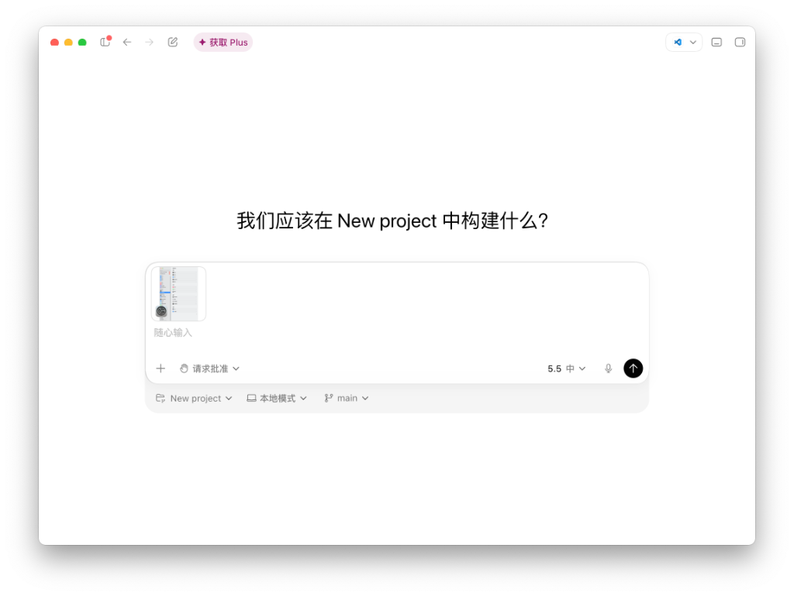

# codex-Mac-intel-appshot (Codex Appshot Intel Mac Patch)

这是一个专门为 Intel 芯片 macOS 设备准备的 Codex Desktop "Appshots"（应用快照）功能修复与优化补丁。

## 效果对比

### 修复前（架构不兼容导致报错）


### 修复后（完美呈现带有图标、标题和无障碍上下文的快照）


## 背景

官方版本的 Codex Desktop 在实现 Appshot 时，依赖了一个名为 `SkyComputerUseService` 的独立后台二进制服务和 Node.js 原生插件 `sky.node`。由于这些组件仅编译了 `arm64`（Apple Silicon）版本，在 Intel（x86_64）芯片的 Mac 上运行时会因为架构不兼容导致程序崩溃或静默失效，并在前端显示“无法附加应用快照”的错误横幅。

本补丁通过重新实现窗口捕获、前台应用元数据获取和无障碍文本（AXText）提取等核心功能，完全在本地使用 Swift 编写并编译了替代工具，重新打补丁并封包了 JavaScript assets，使 Intel Mac 能够完美运行全部 Appshot 功能。

## 组成部分

1. **get_window_id.swift**: 通过应用的 Bundle Identifier 查找并获取当前活动窗口的窗口 ID（CGWindowID），用于精确截图。
2. **get_ax_text.swift**: 使用 macOS NSAccessibility API（无障碍接口）递归遍历前台窗口，提取结构化的无障碍文本树。支持提取复选框与滑块的数值、输入框占位符（AXPlaceholderValue）、帮助提示（kAXHelpAttribute），并在主窗口获取失败时具备自动回退至应用首窗口的容错机制。
3. **get_frontmost_window.swift**: 获取前台活动应用的名称、Bundle ID、应用图标的 Base64 字符串以及当前的窗口网页/文件标题，用于在输入框中渲染带图标的截图预览。
4. **patch.py**: 自动化的安装和打补丁脚本。负责：
   - 编译 Swift 源码并将生成的辅助二进制文件直接存储于 `Codex.app/Contents/Resources/bin/`，使补丁在运行时完全脱离源码目录依赖，即使删除本仓库亦不影响已修好的 Appshot 功能。
   - 解包 `app.asar` 并通过通配符正则自动匹配 Vite 混淆后的 JavaScript 资源文件名（如 `main-*.js`、`composer-*.js`）。
   - 对 `worker.js`、`main.js`、`composer.js` 实施定向插桩，同时自动修补因混淆压缩代码连带导致的 Switch-Case 语法解析边界问题。
   - 封包并替换 `app.asar`
   - 对 Codex.app 进行本地深度重签名并清理权限数据库

## 运行步骤

1. 打开终端并进入本项目根目录。
2. 运行安装与打补丁脚本：
   ```bash
   python3 patch.py
   ```
3. 脚本会自动完成 Swift 编译、ASAR 解包、代码修改、封包替换、深度重签名以及 TCC 数据库清理。
4. 运行结束后，请重新打开 **Codex.app**。

## 权限授权说明（重要）

因为本补丁重新对 Codex.app 进行了本地签名（codesign），macOS 的安全防护数据库（TCC）会失效此前的权限缓存。当重新启动 Codex 并首次触发 Appshot 时，系统会弹出权限请求：
1. **屏幕录制权限**：根据系统弹窗提示，进入“系统设置 -> 隐私与安全性 -> 屏幕录制”，找到 Codex 并重新开启/勾选开关。
2. **辅助功能权限**：进入“系统设置 -> 隐私与安全性 -> 辅助功能”，确认开启 Codex 的辅助功能开关（用于抓取窗口文本和屏幕外内容）。
3. 授权完毕后，**请完全退出并重启一次 Codex.app** 即可永久生效。
